# DeerFlow Node.js 技术方案

> 本文档面向零基础读者，从 AI Agent 的基本概念出发，逐步解释本项目每一个技术细节。

---

## 目录

1. [什么是 AI Agent](#1-什么是-ai-agent)
2. [大语言模型的局限与工具调用](#2-大语言模型的局限与工具调用)
3. [ReAct：Agent 的思考模式](#3-react-agent-的思考模式)
4. [LangGraph：用状态机编排 Agent](#4-langgraph用状态机编排-agent)
5. [项目整体架构](#5-项目整体架构)
6. [Agent Server 详解](#6-agent-server-详解)
7. [API Server 详解](#7-api-server-详解)
8. [流式响应：SSE 协议](#8-流式响应sse-协议)
9. [前端架构详解](#9-前端架构详解)
10. [完整请求链路](#10-完整请求链路)
11. [数据结构设计](#11-数据结构设计)
12. [环境配置与启动](#12-环境配置与启动)
13. [扩展指南](#13-扩展指南)

---

## 1. 什么是 AI Agent

### 1.1 从聊天机器人到 Agent

普通聊天机器人（如早期的 Siri）只能按照预先写好的规则回答问题，本质上是一棵巨大的 if-else 树。

**大语言模型（LLM）** 的出现改变了这一点——它可以理解自然语言、推理复杂问题、生成代码，但它有一个根本限制：**只能生成文字，不能做任何实际操作**。

**AI Agent** 就是为了解决这个问题而生的架构：给 LLM 配备"手"和"眼"——工具（Tools），让它不只是"说"，而是能真正"做"。

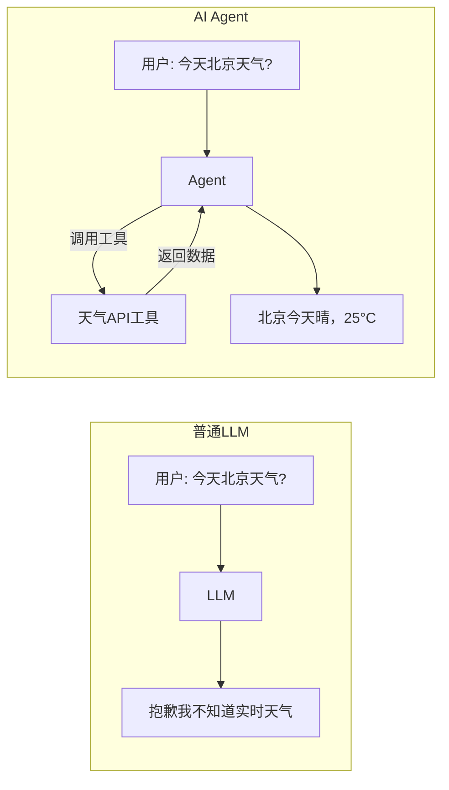

### 1.2 Agent 的三个核心能力

| 能力 | 说明 | 例子 |
|------|------|------|
| **感知** | 接收和理解输入 | 读取用户消息、文件内容 |
| **推理** | 规划下一步行动 | 判断需要搜索还是计算 |
| **行动** | 调用工具执行操作 | 搜索网页、运行代码、写文件 |

### 1.3 Agent 与工作流的区别

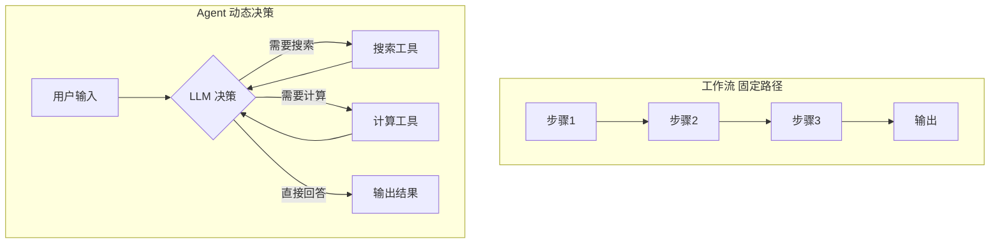

工作流是**静态**的，每一步都预先定义好。Agent 是**动态**的，LLM 自己决定下一步做什么。

---

## 2. 大语言模型的局限与工具调用

### 2.1 LLM 的三大局限

```mermaid
graph TD
    LLM[大语言模型]
    LLM --> L1[知识截止日期<br/>不知道最新信息]
    LLM --> L2[不能执行操作<br/>只能输出文字]
    LLM --> L3[数学计算不准<br/>靠"感觉"算数]

    L1 --> S1[解决方案: 搜索工具]
    L2 --> S2[解决方案: 代码执行工具]
    L3 --> S3[解决方案: 计算器工具]
```

### 2.2 Function Calling 机制

现代 LLM（如 GPT-4、Claude）支持 **Function Calling**（也叫 Tool Use）：

1. 开发者把工具的**名称、描述、参数格式**告诉 LLM
2. LLM 在需要时不直接回答，而是输出一段 JSON 说"我要调用这个工具，参数是这些"
3. 程序解析这段 JSON，真正执行工具
4. 把执行结果塞回给 LLM 继续推理

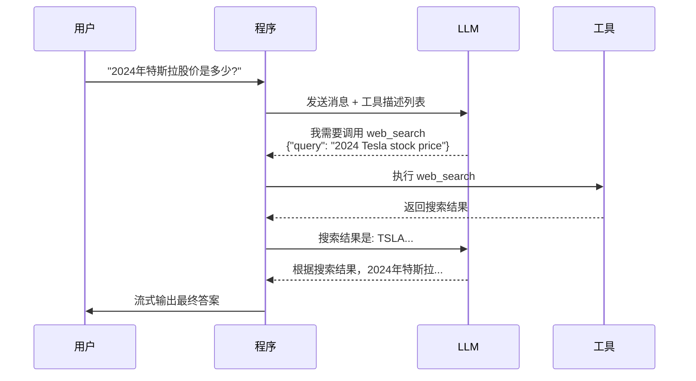

### 2.3 工具的定义方式

本项目用 LangChain 的 `tool()` 函数定义工具，它会自动生成 JSON Schema 告诉 LLM 工具的用法：

```typescript
// packages/agent/src/tools/calculator.ts

export const calculatorTool = tool(
  async ({ expression }) => {
    // 这是工具的实际执行逻辑
    return safeEval(expression).toString();
  },
  {
    name: "calculator",
    // description 非常重要——LLM 根据这段文字决定什么时候调用这个工具
    description: "Evaluate mathematical expressions accurately...",
    schema: z.object({
      expression: z.string().describe('e.g. "2 + 3 * 4"'),
    }),
  }
);
```

LLM 实际收到的工具描述是这样的 JSON：

```json
{
  "name": "calculator",
  "description": "Evaluate mathematical expressions accurately...",
  "parameters": {
    "type": "object",
    "properties": {
      "expression": {
        "type": "string",
        "description": "e.g. \"2 + 3 * 4\""
      }
    },
    "required": ["expression"]
  }
}
```

---

## 3. ReAct：Agent 的思考模式

### 3.1 什么是 ReAct

**ReAct = Reasoning + Acting（推理 + 行动）**，是目前最主流的 Agent 设计模式，由 Google 于 2022 年提出。

核心思路是让 LLM 交替进行两种操作：
- **Thought（思考）**：分析当前情况，规划下一步
- **Action（行动）**：调用工具获取信息
- **Observation（观察）**：看工具返回了什么

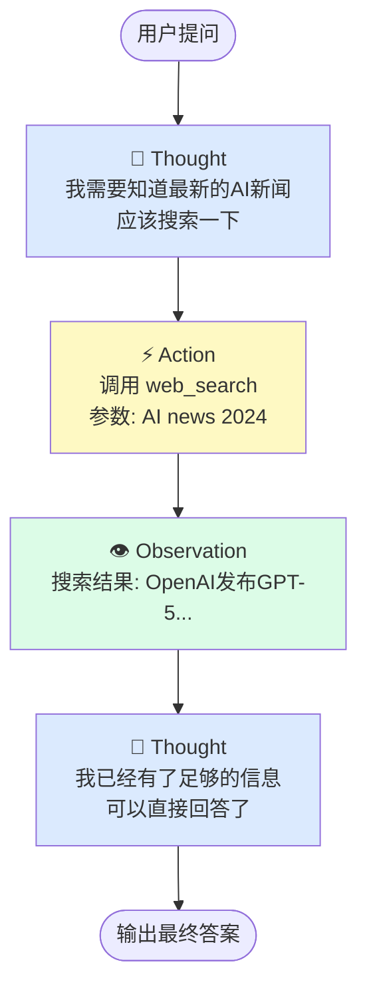

### 3.2 一个真实的 ReAct 对话轨迹

用户问："帮我计算 (123 + 456) × 789 是多少？然后搜索这个数字有什么特殊含义"

```
[Thought] 我需要先计算这个表达式
[Action]  calculator({ "expression": "(123 + 456) * 789" })
[Obs]     结果: 456831

[Thought] 得到了 456831，现在需要搜索它的含义
[Action]  web_search({ "query": "456831 special meaning" })
[Obs]     搜索结果: ...

[Thought] 我现在有足够的信息来完整回答用户了
[Final]   (123 + 456) × 789 = 456831。根据搜索结果...
```

### 3.3 ReAct 循环的终止条件

Agent 不会无限循环，有两种终止方式：

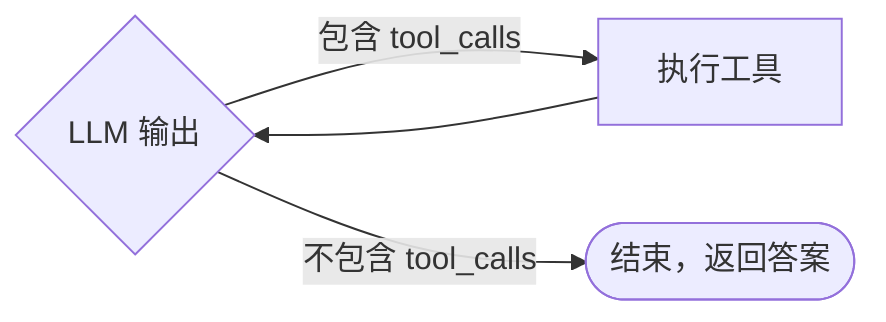

当 LLM 认为已经收集到足够信息，它的输出就不再包含 `tool_calls`，循环自然终止。

---

## 4. LangGraph：用状态机编排 Agent

### 4.1 为什么需要 LangGraph

直接用代码写 ReAct 循环也可以，但会面临很多问题：
- 如何处理多轮工具调用？
- 如何保存对话历史？
- 如何在 Agent 运行中途暂停等用户确认？
- 如何流式输出每一个 token？

**LangGraph** 是 LangChain 团队开发的框架，把 Agent 建模为**有向图（Graph）**，每个节点是一个处理步骤，边是节点间的跳转逻辑。

### 4.2 状态图的核心概念

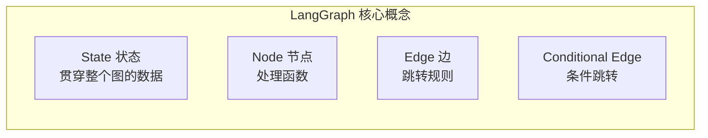

**State（状态）**：图中流转的数据，每个节点读取状态、产生更新，更新自动合并回状态。

**Node（节点）**：一个普通的 async 函数，接收 state 返回更新。

**Edge（边）**：固定跳转，比如"工具执行完后，固定回到 agent 节点"。

**Conditional Edge（条件边）**：根据当前状态动态决定跳转到哪个节点。

### 4.3 本项目的 Agent 图

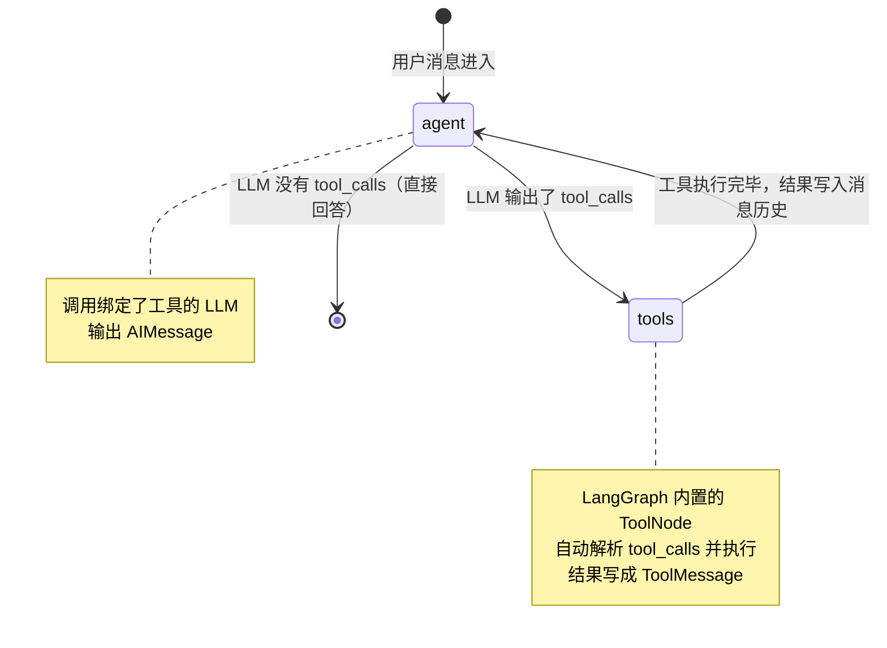

### 4.4 状态的定义与合并

```typescript
// packages/agent/src/graph/state.ts

export const AgentState = Annotation.Root({
  messages: Annotation<BaseMessage[]>({
    // messagesStateReducer 是 LangGraph 内置的合并函数
    // 它不会替换整个数组，而是智能追加/更新
    reducer: messagesStateReducer,
    default: () => [],
  }),
});
```

消息历史是整个图的核心状态，每轮对话后消息列表会增长：

```
初始:    [HumanMessage("帮我搜索...")]
第1轮后: [HumanMessage, AIMessage(tool_calls=[search])]
第2轮后: [HumanMessage, AIMessage, ToolMessage(search_result)]
第3轮后: [HumanMessage, AIMessage, ToolMessage, AIMessage("根据搜索结果...")]
```

### 4.5 路由函数——图的"大脑"

```typescript
// packages/agent/src/graph/nodes.ts

export function routeAfterAgent(state: AgentStateType): "tools" | "__end__" {
  const lastMessage = state.messages[state.messages.length - 1];

  // 检查最新消息是否包含工具调用请求
  if (lastMessage && "tool_calls" in lastMessage
      && lastMessage.tool_calls?.length > 0) {
    return "tools";  // 有工具调用 → 去执行工具
  }

  return "__end__";  // 没有工具调用 → 结束
}
```

---

## 5. 项目整体架构

### 5.1 三服务架构概览

本项目采用**前后端 + Agent 服务分离**的三层架构，每层职责清晰：

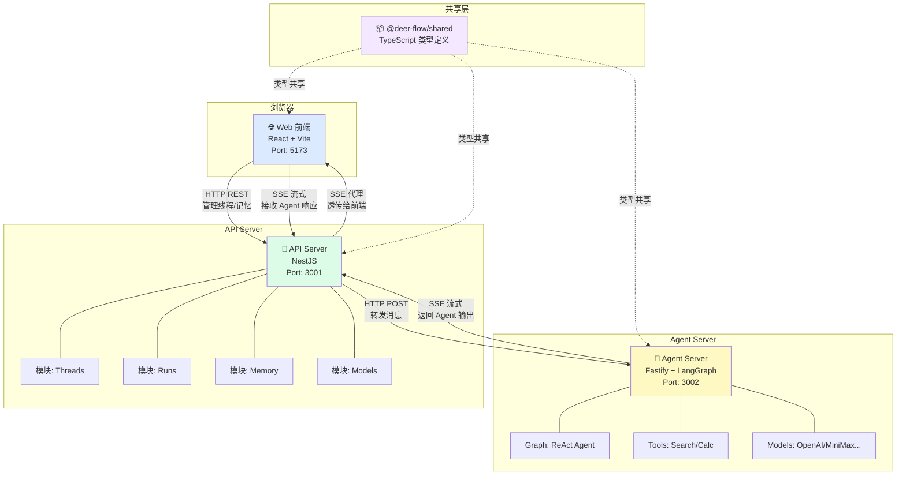

### 5.2 为什么要分三个服务？

**不分离的问题：**
- Agent 执行是 CPU/IO 密集型，会阻塞其他请求
- 不同服务可以独立扩容（Agent Server 需要更多资源）
- Agent Server 可以替换为 Python 实现（LangGraph 官方支持更好）

**分离后的好处：**

| 服务 | 特点 | 可替换为 |
|------|------|--------|
| Agent Server | 执行 AI 推理，耗时长 | Python FastAPI + LangGraph |
| API Server | 管理数据，响应快 | 任何语言的 REST 框架 |
| Web | 纯前端展示 | 任何前端框架 |

### 5.3 pnpm Workspace 管理多包

```
ai-agent/                      ← Workspace 根目录
├── pnpm-workspace.yaml        ← 声明哪些目录是 package
├── package.json               ← 根目录脚本
├── tsconfig.base.json         ← 共享 TS 配置
└── packages/
    ├── shared/                ← 包1: 类型定义
    ├── agent/                 ← 包2: Agent 服务
    ├── api/                   ← 包3: API 服务
    └── web/                   ← 包4: 前端
```

`pnpm-workspace.yaml` 的内容：
```yaml
packages:
  - 'packages/*'   # packages/ 下每个目录都是一个 package
```

包之间引用用 `workspace:*` 协议：
```json
// packages/api/package.json
{
  "dependencies": {
    "@deer-flow/shared": "workspace:*"  // 引用本地的 shared 包
  }
}
```

---

## 6. Agent Server 详解

### 6.1 职责与技术选型

**职责**：接收消息 → 运行 LangGraph Agent → 流式返回结果

**为什么选 Fastify**：
- 比 Express 快约 2 倍
- 原生支持 async/await
- 可以直接操作 `reply.raw`（原始 Node.js Response），这对 SSE 流式输出至关重要

### 6.2 模型提供商工厂

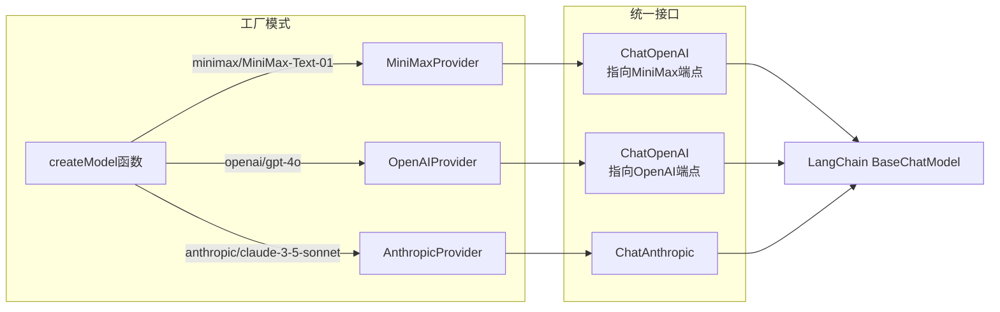

**关键设计：MiniMax 使用 OpenAI 兼容接口**

MiniMax 提供了与 OpenAI 完全兼容的 API，只需换一个 `baseURL`：

```typescript
// packages/agent/src/models/minimax.ts

export class MiniMaxProvider implements IModelProvider {
  createModel(config: ModelProviderConfig) {
    return new ChatOpenAI({
      openAIApiKey: config.apiKey,
      modelName: config.modelName,  // e.g. "MiniMax-Text-01"
      configuration: {
        baseURL: "https://api.minimaxi.chat/v1",  // 替换为 MiniMax 的端点
      },
    });
  }
}
```

**注册表驱动**，新增提供商只改一处：

```typescript
// packages/agent/src/models/factory.ts

const PROVIDER_REGISTRY = {
  minimax: {
    instance: new MiniMaxProvider(),
    envKey: "MINIMAX_API_KEY",        // 读哪个环境变量
    models: [
      { name: "MiniMax-Text-01", displayName: "MiniMax Text-01" },
      { name: "MiniMax-M1",      displayName: "MiniMax M1 (Reasoning)" },
    ],
  },
  // 新增提供商: 在这里加一条，其他地方不用改
};
```

### 6.3 工具系统

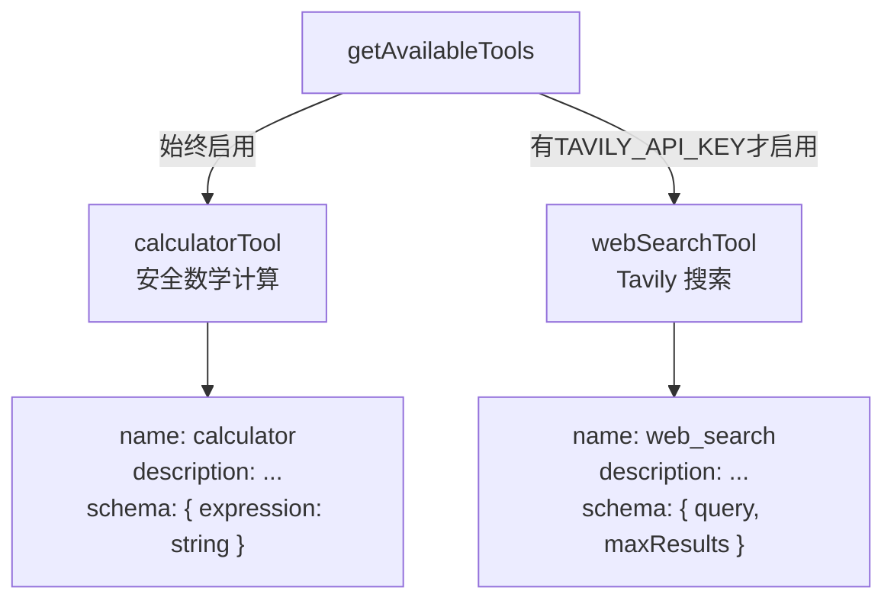

**计算器工具的安全设计**：

LLM 直接用 `eval()` 执行代码非常危险，可能执行任意代码。本项目的计算器工具采用白名单过滤：

```typescript
// packages/agent/src/tools/calculator.ts

function safeEval(expression: string): number {
  // 1. 只允许数字、运算符、括号、Math 函数
  // 2. 用 Function 构造器在受限作用域执行
  const fn = new Function("Math", `"use strict"; return (${normalized})`);
  return fn(Math); // 只传入 Math，无法访问其他全局变量
}
```

### 6.4 LangGraph 图的构建

```typescript
// packages/agent/src/graph/graph.ts

export function buildAgentGraph(modelName?: string) {
  const model = createModel(modelName);  // 创建 LLM 实例
  const tools = getAvailableTools();     // 获取可用工具列表

  const graph = new StateGraph(AgentState)
    // 注册节点
    .addNode("agent", createAgentNode(model, tools))  // LLM 推理节点
    .addNode("tools", createToolNode(tools))           // 工具执行节点

    // 定义边
    .addEdge(START, "agent")       // 入口 → agent
    .addConditionalEdges("agent", routeAfterAgent, {
      tools: "tools",              // 有工具调用 → tools
      __end__: END,                // 无工具调用 → 结束
    })
    .addEdge("tools", "agent");    // 工具完成 → 回到 agent

  return graph.compile();
}
```

---

## 7. API Server 详解

### 7.1 NestJS 依赖注入

**依赖注入（Dependency Injection，DI）** 是 NestJS 的核心特性，解决了"谁来创建对象"的问题。

**没有 DI 的写法（问题）**：

```typescript
class RunsService {
  // 每次使用都要手动创建依赖，很难替换和测试
  private config = new AppConfigService();
  private threads = new ThreadsService(new StoreService());
}
```

**有 DI 的写法（NestJS）**：

```typescript
@Injectable()
class RunsService {
  constructor(
    // NestJS 自动创建并注入，不需要手动 new
    private readonly config: AppConfigService,
    private readonly threads: ThreadsService,
  ) {}
}
```

NestJS 的 IoC 容器负责管理所有对象的生命周期和依赖关系：

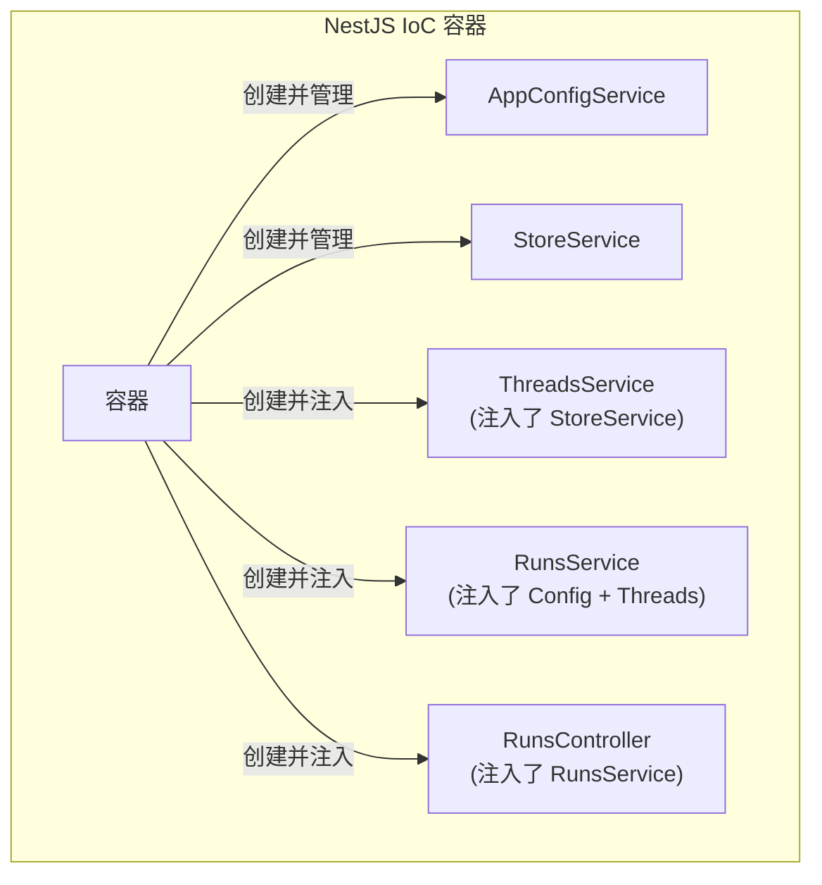

### 7.2 模块化结构

每个业务功能是一个独立的 Module，互相隔离：

```mermaid
graph TD
    APP[AppModule 根模块]
    APP --> CM[ConfigModule\n@Global 全局]
    APP --> SM[StoreModule\n@Global 全局]
    APP --> TM[ThreadsModule]
    APP --> RM[RunsModule]
    APP --> MM[ModelsModule]
    APP --> MEM[MemoryModule]

    TM --> TC[ThreadsController\nGET/POST/PATCH/DELETE]
    TM --> TS[ThreadsService\n业务逻辑]
    TS -->|注入| SS[StoreService]

    RM --> RC[RunsController\nPOST /runs]
    RM --> RS[RunsService\nSSE 代理]
    RS -->|注入| CS[AppConfigService]
    RS -->|注入| TS2[ThreadsService]
```

### 7.3 SSE 代理的实现

API Server 拿到前端请求后，不自己执行 Agent，而是把请求**透传**给 Agent Server，再把 Agent Server 的 SSE 流**代理**回前端：

```typescript
// packages/api/src/modules/runs/runs.service.ts

async streamRun(threadId: string, message: string, res: Response) {
  // 1. 设置本次响应为 SSE 格式
  res.setHeader("Content-Type", "text/event-stream");
  res.flushHeaders();

  // 2. 调用 Agent Server（也是 SSE 响应）
  const agentResponse = await fetch(`${agentServerUrl}/runs`, {
    method: "POST",
    body: JSON.stringify({ message }),
  });

  // 3. 用 ReadableStream 读取 Agent Server 的 SSE 流
  const reader = agentResponse.body.getReader();

  while (true) {
    const { done, value } = await reader.read();
    if (done) break;
    // 4. 每读到一块数据，立刻写给前端
    res.write(value);
  }

  res.end();
}
```

### 7.4 StoreService：可替换的存储抽象

当前实现用内存（Map），生产环境只需替换实现，不需要改任何业务代码：

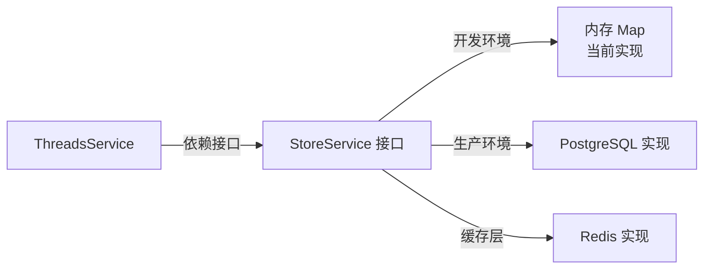

---

## 8. 流式响应：SSE 协议

### 8.1 为什么需要流式输出

LLM 生成回答不是一次性输出，而是一个 token 一个 token 地生成（就像人打字一样）。

如果等待全部生成完再返回：
- 用户需要等待 5-30 秒才看到任何内容
- 体验极差

如果使用流式输出：
- 用户几乎立刻看到第一个字
- 就像有人在实时打字

### 8.2 SSE 协议详解

**Server-Sent Events（SSE）** 是一种服务器向客户端单向推送数据的 HTTP 协议。

**与 WebSocket 的区别**：

| 特性 | SSE | WebSocket |
|------|-----|-----------|
| 方向 | 服务器 → 客户端（单向） | 双向 |
| 协议 | 普通 HTTP | WS 协议 |
| 重连 | 自动重连 | 需要手动 |
| 适用场景 | 流式输出、通知 | 实时聊天、游戏 |

**SSE 报文格式**：

```
HTTP/1.1 200 OK
Content-Type: text/event-stream   ← 关键 Header
Cache-Control: no-cache
Connection: keep-alive

event: message                     ← 事件类型
data: {"type":"text_delta","delta":"你"} ← 数据（JSON）

event: message
data: {"type":"text_delta","delta":"好"}

event: message
data: {"type":"run_complete","finalMessage":"你好！..."}

```

每个事件之间用**空行**（`\n\n`）分隔，这是 SSE 协议规定的帧边界。

### 8.3 本项目的 SSE 事件类型

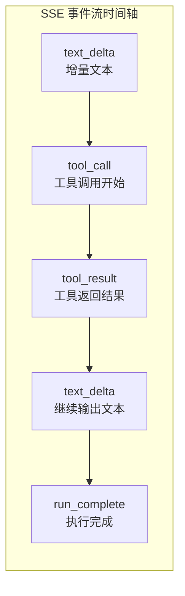

**事件定义**（在 `packages/shared/src/types/run.ts` 中）：

```typescript
// 增量文本（每个 token 一个事件）
{ type: "text_delta", delta: "你" }

// 工具调用开始
{ type: "tool_call", toolCallId: "call_abc", toolName: "web_search",
  args: { query: "AI news" } }

// 工具返回结果
{ type: "tool_result", toolCallId: "call_abc", output: "搜索结果...", isError: false }

// 全部完成
{ type: "run_complete", runId: "run_123", finalMessage: "完整答案..." }

// 出错
{ type: "run_error", message: "API 调用失败" }
```

### 8.4 LangGraph → SSE 转换

```typescript
// packages/agent/src/streaming/bridge.ts

export async function* streamAgentRun(userMessage: string, model?: string) {
  const graph = buildAgentGraph(model);

  // streamEvents 返回细粒度的执行事件
  const eventStream = graph.streamEvents(
    { messages: [new HumanMessage(userMessage)] },
    { version: "v2" }
  );

  for await (const event of eventStream) {
    // LangGraph 事件类型 → 本项目 SSE 事件类型
    if (event.event === "on_chat_model_stream") {
      // LLM 输出了一个 token
      const text = event.data?.chunk?.content;
      yield formatSSEFrame("message", { type: "text_delta", delta: text });
    }

    if (event.event === "on_tool_start") {
      // 工具开始执行
      yield formatSSEFrame("message", {
        type: "tool_call",
        toolName: event.name,
        args: event.data?.input,
      });
    }
    // ...
  }
}
```

### 8.5 前端接收 SSE

前端用 `fetch` + `ReadableStream` 接收（比 `EventSource` 更灵活，支持 POST）：

```typescript
// packages/web/src/hooks/useStreaming.ts

const response = await fetch(`/api/threads/${threadId}/runs`, {
  method: "POST",
  body: JSON.stringify({ message }),
});

const reader = response.body.getReader();
const decoder = new TextDecoder();
let buffer = "";

while (true) {
  const { done, value } = await reader.read();
  if (done) break;

  buffer += decoder.decode(value, { stream: true });

  // SSE 帧以 \n\n 分隔
  const frames = buffer.split("\n\n");
  buffer = frames.pop() ?? "";  // 最后一个可能不完整，先缓存

  for (const frame of frames) {
    const event = parseSSEFrame(frame);  // 解析 JSON
    if (event) {
      handleStreamEvent(threadId, event); // 更新 UI 状态
    }
  }
}
```

---

## 9. 前端架构详解

### 9.1 整体组件树

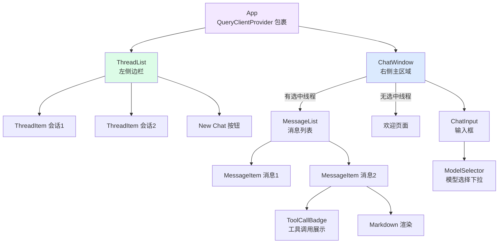

### 9.2 状态管理：Zustand

**为什么选 Zustand 而不是 Redux**：
- Redux 需要大量模板代码（action、reducer、dispatch）
- Zustand API 极简，直接在 store 里写方法

```typescript
// packages/web/src/store/appStore.ts

export const useAppStore = create<AppState>((set, get) => ({
  // 状态
  activeThreadId: null,
  messagesByThread: {},
  isStreaming: false,
  selectedModel: null,

  // 方法（直接修改状态，不需要 action/reducer）
  setActiveThread: (id) => set({ activeThreadId: id }),

  // 处理 SSE 事件（核心逻辑）
  handleStreamEvent: (threadId, event) => {
    set((state) => {
      // 找到正在流式输出的消息
      const messages = [...state.messagesByThread[threadId]];
      const streamingMsg = messages.findLast(m => m.isStreaming);

      switch (event.type) {
        case "text_delta":
          streamingMsg.content += event.delta;  // 追加文本
          break;
        case "tool_call":
          streamingMsg.toolCalls.push({ ... });  // 记录工具调用
          break;
        case "run_complete":
          streamingMsg.isStreaming = false;  // 标记完成
          break;
      }

      return { messagesByThread: { ...state.messagesByThread } };
    });
  },
}));
```

### 9.3 数据请求：TanStack Query

**TanStack Query** 解决了数据获取的所有痛点：

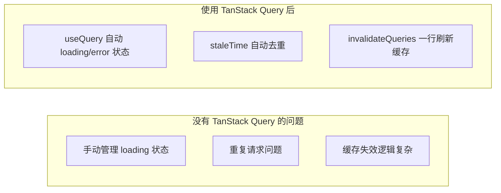

```typescript
// packages/web/src/hooks/useThreads.ts

// 获取线程列表（自动缓存 30 秒）
export function useThreadList() {
  return useQuery({
    queryKey: ["threads"],
    queryFn: () => api.threads.list(),
    staleTime: 30_000,
  });
}

// 创建线程（成功后自动刷新列表）
export function useCreateThread() {
  const queryClient = useQueryClient();
  return useMutation({
    mutationFn: () => api.threads.create(),
    onSuccess: () => {
      queryClient.invalidateQueries({ queryKey: ["threads"] });
    },
  });
}
```

### 9.4 关键 Bug：Zustand 无限渲染陷阱

这是一个容易犯的错误，值得专门说明：

```typescript
// ❌ 错误写法：每次渲染都创建新数组引用
const messages = useAppStore(
  (state) => state.messagesByThread[threadId] ?? []
  //                                            ^^^
  //                   每次调用都是新的 [] 对象
  //                   Zustand 比较 Object.is([], []) → false
  //                   → 认为状态变了 → 触发重渲染 → 无限循环
);

// ✅ 正确写法：使用模块级稳定引用
const EMPTY: AppMessage[] = [];  // 模块级常量，永远是同一个对象

const EMPTY: AppMessage[] = [];
const selector = useMemo(
  () => (state) => state.messagesByThread[threadId] ?? EMPTY,
  [threadId]
);
const messages = useAppStore(selector);
```

---

## 10. 完整请求链路

### 10.1 发送一条消息的完整流程

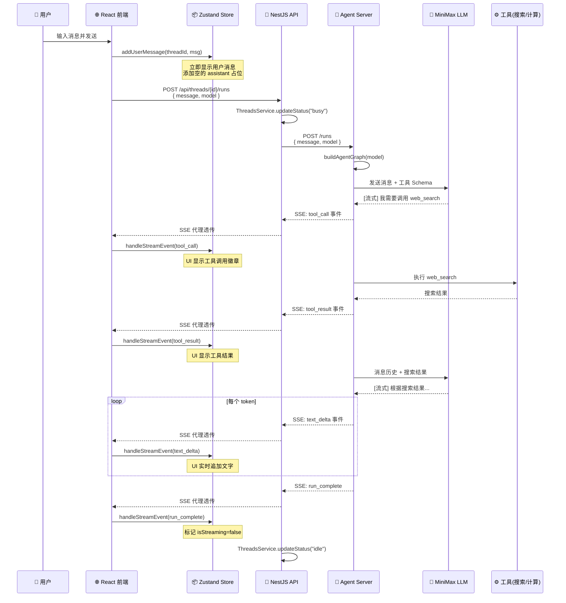

### 10.2 模型选择的传递链路

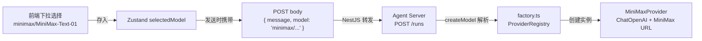

---

## 11. 数据结构设计

### 11.1 核心实体关系

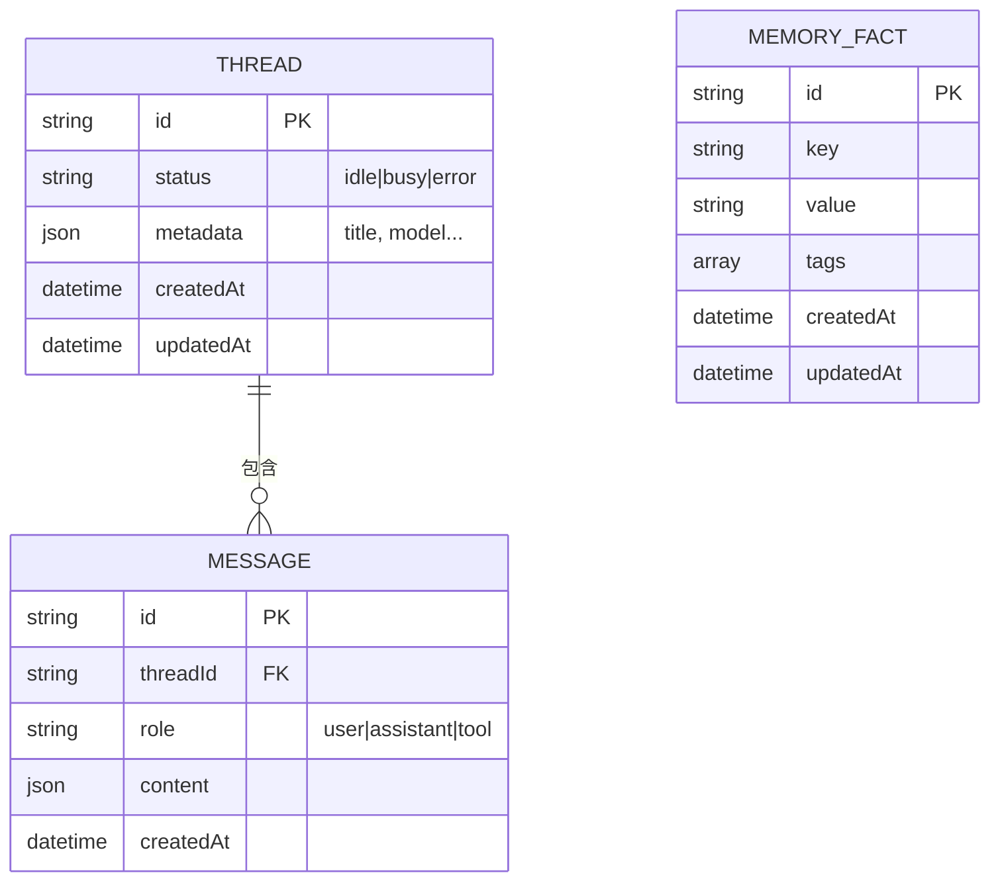

### 11.2 SSE 事件的完整类型定义

```typescript
// packages/shared/src/types/run.ts

// 所有可能的 SSE 事件（联合类型）
export type StreamEvent =
  | { type: "text_delta";   delta: string }
  | { type: "tool_call";    toolCallId: string; toolName: string; args: Record<string, unknown> }
  | { type: "tool_result";  toolCallId: string; output: string; isError: boolean }
  | { type: "run_complete"; runId: string; finalMessage: string }
  | { type: "run_error";    message: string }
  | { type: "title_update"; title: string };
```

通过 TypeScript 联合类型 + `switch(event.type)`，编译器会自动推断每种事件的字段，避免运行时错误。

### 11.3 前端 AppMessage 结构

```typescript
// packages/web/src/store/appStore.ts

interface AppMessage {
  id: string;
  role: "user" | "assistant";
  content: string;           // 文本内容（流式追加）

  toolCalls?: Array<{
    id: string;
    name: string;             // 工具名
    args: Record<string, unknown>;  // 调用参数
    result?: string;          // 执行结果（异步填入）
  }>;

  isStreaming?: boolean;      // 是否还在流式输出
  createdAt: Date;
}
```

---

## 12. 环境配置与启动

### 12.1 环境变量加载机制

```mermaid
graph TD
    ENV[".env 文件\n位于 monorepo 根目录"]

    subgraph API Server CommonJS
        API_MAIN["main.ts\nimport {config} from 'dotenv'\nconfig({ path: resolve(__dirname, '../../../.env') })"]
    end

    subgraph Agent Server ESM
        AGT_MAIN["server.ts\nconst __dirname = dirname(fileURLToPath(import.meta.url))\nloadEnv({ path: resolve(__dirname, '../../../.env') })"]
    end

    ENV -->|__dirname 计算绝对路径| API_MAIN
    ENV -->|import.meta.url 计算绝对路径| AGT_MAIN
```

**为什么不用默认的 `import "dotenv/config"`**：

`dotenv/config` 默认从 `process.cwd()`（当前工作目录）找 `.env`。在 monorepo 中，各包的 CWD 是自己的目录（`packages/api/`），不是根目录，找不到根目录的 `.env`。

### 12.2 三终端启动

```bash
# 终端 1 - Agent Server
cd /path/to/ai-agent
pnpm --filter @deer-flow/agent dev
# 看到: 🦌 DeerFlow Agent Server running at http://0.0.0.0:3002

# 终端 2 - API Server
pnpm --filter @deer-flow/api dev
# 看到: 🚀 DeerFlow API Server running at http://localhost:3001/api

# 终端 3 - Web 前端
pnpm --filter @deer-flow/web dev
# 看到: Local: http://localhost:5173/
```

### 12.3 请求验证

```bash
# 1. 验证 Agent Server
curl http://localhost:3002/health
# → {"status":"ok"}

# 2. 验证模型列表
curl http://localhost:3002/models
# → {"models":[{"name":"minimax/MiniMax-Text-01",...}]}

# 3. 验证 API Server
curl http://localhost:3001/api/models
# → {"models":[...]}

# 4. 创建线程
curl -X POST http://localhost:3001/api/threads \
  -H "Content-Type: application/json" -d '{}'
# → {"id":"xxx","status":"idle",...}
```

---

## 13. 扩展指南

### 13.1 新增 LLM 提供商

```mermaid
flowchart LR
    S1["1. 创建 packages/agent/src/models/deepseek.ts\n实现 IModelProvider 接口"]
    S2["2. 在 factory.ts 的 PROVIDER_REGISTRY 注册\n添加 envKey/baseUrlKey/models"]
    S3["3. 在 api/modules/models/models.service.ts\n的 PROVIDER_CATALOG 添加同样的条目"]
    S4["4. 在 .env 设置 DEEPSEEK_API_KEY"]

    S1 --> S2 --> S3 --> S4
```

### 13.2 新增工具

```mermaid
flowchart LR
    T1["1. 创建 packages/agent/src/tools/my-tool.ts\n用 tool() 定义名称/描述/schema/执行函数"]
    T2["2. 在 tools/index.ts 的 getAvailableTools() 注册\n可按条件启用（检查 API Key 等）"]

    T1 --> T2
```

### 13.3 替换存储后端

```mermaid
graph TD
    OLD["当前: StoreService（内存 Map）\n重启后数据丢失"]
    NEW1["替换方案1: PostgreSQL\n使用 TypeORM 或 Drizzle"]
    NEW2["替换方案2: Redis\n适合高并发场景"]

    subgraph 替换步骤
        R1["1. 新建 PostgresStoreService\n实现同样的 get/set/delete/getByPrefix 方法"]
        R2["2. 在 store.module.ts 替换 provider\n{ provide: StoreService, useClass: PostgresStoreService }"]
    end

    OLD --> NEW1
    OLD --> NEW2
    NEW1 & NEW2 --> R1 --> R2
```

所有业务代码（ThreadsService、MemoryService 等）通过 DI 注入 `StoreService`，替换实现后完全不用改业务代码，这就是依赖注入的价值。

---

## 附：技术栈汇总

| 层级 | 技术 | 版本 | 选型理由 |
|------|------|------|--------|
| **Agent 框架** | LangGraph.js | 0.2.x | 官方 JS 版，支持 StateGraph + 细粒度 streamEvents |
| **Agent HTTP** | Fastify | 4.x | 比 Express 快 2 倍，原生 async，支持操控原始 Response |
| **API 框架** | NestJS | 10.x | 完整 DI 容器，模块化架构，企业级 Node.js 框架 |
| **类型系统** | TypeScript | 5.x | 全栈统一类型，编译时发现跨包接口不一致 |
| **包管理** | pnpm workspace | 9.x | 节省磁盘、软链接隔离、原生 monorepo 支持 |
| **前端框架** | React | 18.x | 生态最完善的 UI 框架 |
| **构建工具** | Vite | 5.x | 毫秒级热更新，ESM 原生 |
| **全局状态** | Zustand | 5.x | API 极简，无模板代码，适合中型应用 |
| **数据请求** | TanStack Query | 5.x | 自动缓存、重试、状态管理 |
| **样式** | TailwindCSS | 3.x | 原子类，无 CSS 文件，快速迭代 |
| **流式协议** | SSE | HTTP/1.1 | 单向推送，天然适合 AI 输出场景 |
